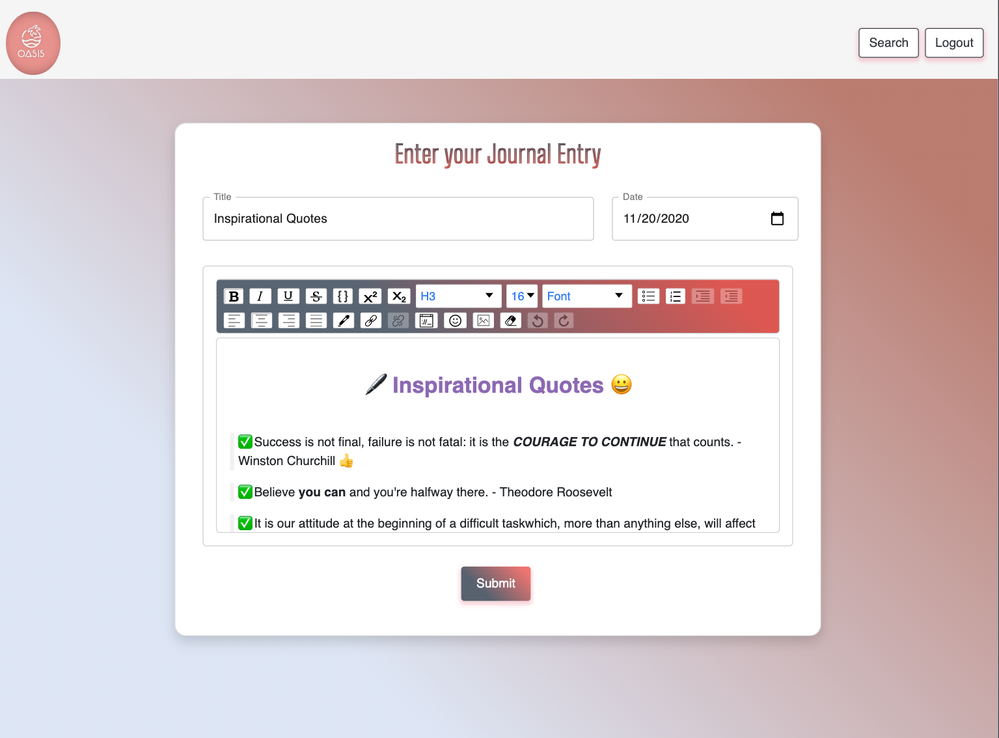
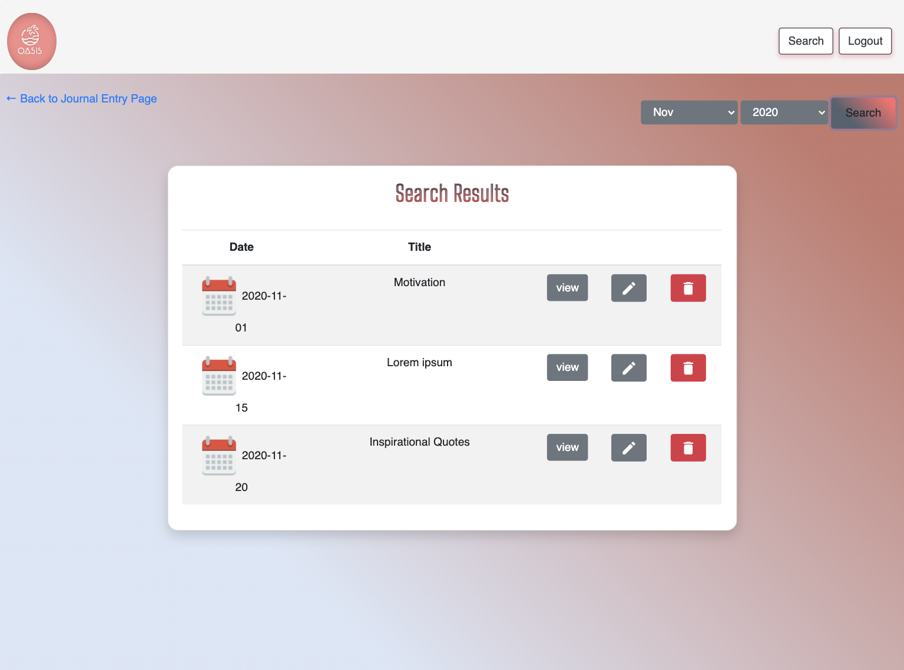

# Oasis Journal Application

# Description

Online journal Application that allows both young and young at heart to write their thoughts, feelings and emotions into a safe, secure and fun journal app. It is more important than ever to cultivate self care and self awareness. Studies show that bringing your thoughts, ideas, emotions, feelings and putting into words can help self reflection and get rid of negativity, thus bringing gratitude and peace of mind.

This application is built using **MERN Stack** and **Draft js rich TextEditor** where user can pick a calendar date and write a journal entry using all the styles of text editor. Also user can search journal entries for particular month and view, edit or delete them.

#### **[Deployed Application](https://oasis-diary.herokuapp.com/)**

## Table of Contents

* [Demo](#demo)
* [Preview](#preview)
* [Features](#features)
* [Installation](#installation)
* [Technology](#technology)
* [Contributors](#contributors)
* [Questions](#Questions)

# Demo : 

# Preview : 

### Landing Page

|Medium Devices/ Laptop|Small Devices/ Tablet|Extra Small Devices/Phone
|--|--|--
|||

### Journal and Search page

|Journal Page|Search Results|
|--|--
||

# Features : 

1. User is authenticated by Login/SignUp.

2. User can enter their Journal entries using **Draft js Rich Text Editor**.

3. User can change date using calendar to fetch journal entry for that day and update it.

4. User can search journal entries for particular month and year.

5. User can also view, update, delete their Journal entries got from search results.

# Installation

1. Clone the [repo](https://github.com/GauriKhandke/oasis) to your local machine.

2. On your local repo, run `npm install` to install dependencies.

3. Create a file titled `.env` in the root folder of your local repo. Inside it, you will include your strong password.
   <pre><code>JWT_SECRET = (random password)</code></pre>

4. Run `npm start` to start the application. Your app should now be running on <http://localhost:3000>.

# Technology:

#### [React](https://reactjs.org/):
* React makes it painless to create interactive UIs. Design simple views for each state in your application, and React will efficiently update and render just the right components when your data changes.

#### [Draft JS](https://draftjs.org/):
* Draft JS provides the building blocks to enable the creation of a broad variety of rich text composition experiences, from basic text styles to embedded media.

#### [Express](https://www.npmjs.com/package/expres):
* Express is a minimal and flexible Node.js web application framework that provides a robust set of features to develop web and mobile applications. It facilitates the rapid development of Node based Web applications.

#### [MongoDB](https://www.mongodb.com/):
* MongoDB is a general purpose, document-based, distributed database built for modern application developers and for the cloud era.

#### [Node.js ](https://nodejs.org/en/):
* Node.js is an open-source and cross-platform JavaScript runtime environment.A Node.js app is run in a single process, without creating a new thread for every request.

#### [JSON Web Token](https://www.npmjs.com/package/jsonwebtoken):
* JSON Web Token (JWT) is a compact, URL-safe means of representing claims to be transferred between two parties.  The claims in a JWT are encoded as a JSON object that is used as the payload of a JSON. Web Signature (JWS) structure or as the plaintext of a JSON Web Encryption (JWE) structure, enabling the claims to be digitally signed or integrity protected with a Message Authentication Code (MAC) and/or encrypted.

#### [BCRYPT](https://www.npmjs.com/package/bcrypt):
* A library to help you hash passwords.

# License

This project is licensed under MIT License.

# Contribution

Please let us know how we can improve this project. Issues and pull requests are always welcome.

# Contributors: 
* [Gauri Khandke](https://github.com/GauriKhandke)
* [Pratyusha Raghupatruni](https://github.com/PratyushaRaghupatruni)
* [Daniel Balderas Hafertepen](https://github.com/danybb2020)
* [Brandon Johnson](https://github.com/sheikb08)
* [Robeil Aregawi](https://github.com/Robeil)

# Questions :
* If you have any questions about the repo, here is our repo to submit issue 
  https://github.com/GauriKhandke/oasis/issues/new